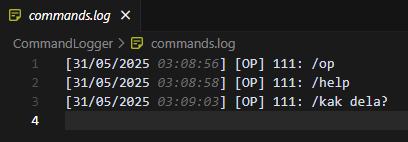

# 📑 CommandLogger 
```minecraft plugin```
<br>

## Features:
- 📰 Logs all commands 
- 📕 Supports excluded commands 
- 📗 Supports enabled commands
- 🍀 Support LuckPerms prefix 

## Usage:
```Add the .jar file to the server's plugins folder, then start or restart your server.```

## Dependencies:
- ☕ ```Java 21+```
- 🧩 ```Paper 1.21.4+```
- 🍀 ```Plugin LuckPerms```

## Screenshot:


by localhost \
(discord: **```only_localhost```** || telegram: **```@local_explorer```**)
